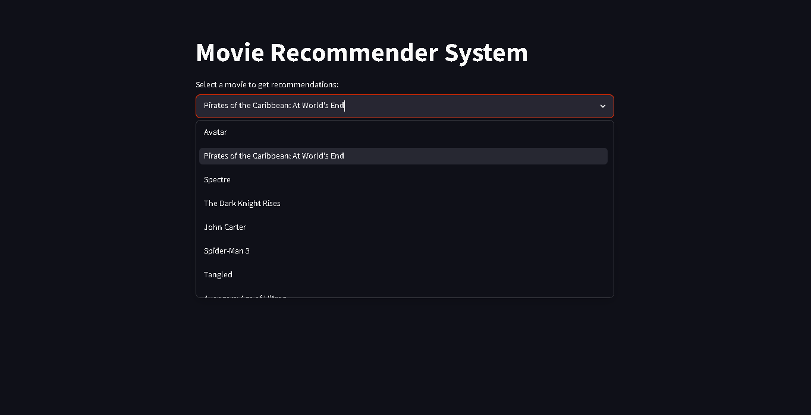
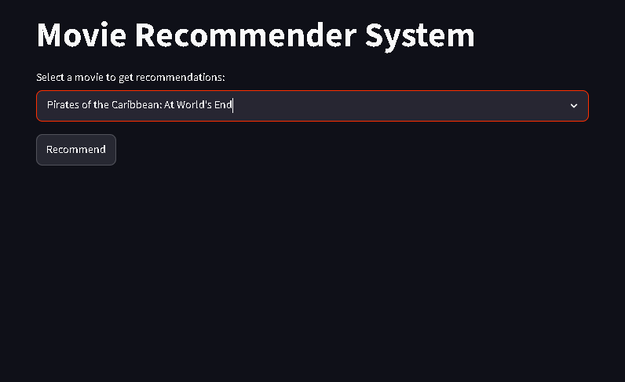

# Movie-Recommender-System
Movie recommender web application that suggests similar movies using machine learning and Streamlit.

# 🎬 Movie Recommender System

A Machine Learning-powered movie recommendation web application built with **Python** and **Streamlit**. The application recommends similar movies using a **Content-Based Filtering** algorithm with **Cosine Similarity**.

## 🚀 Live Demo

🔗 https://movie-recommender-adi.streamlit.app/
--
## 📸 Screenshots

<table>
<tr>
<td align="center">
<b>🏠 Home Page</b><br><br>

</td>

<td align="center">
<b>🎬 Movie Selection</b><br><br>

</td>

<td align="center">
<b>⭐ Recommendations</b><br><br>

</td>
</tr>
</table>
--
## ✨ Features

- 🎥 Search from thousands of movies
- 🤖 Content-Based Movie Recommendation
- ⚡ Fast recommendation generation
- 🌐 Interactive Streamlit web interface
- 📊 Machine Learning powered

---

## 🛠️ Tech Stack

- Python
- Streamlit
- Pandas
- NumPy
- Scikit-learn
- Pickle
- Requests API

---

## 📂 Project Structure

```text
Movie-Recommender-System/
│
├── assets/
├── notebooks/
├── app.py
├── movies.pkl
├── similarity.pkl
├── requirements.txt
└── README.md
```

---

## 🧠 How It Works

1. Data Cleaning
2. Feature Engineering
3. Text Vectorization
4. Cosine Similarity Calculation
5. Recommend Top 5 Similar Movies

---

## 📊 Dataset

- TMDB 5000 Movies Dataset
- TMDB 5000 Credits Dataset

---

## ⚙️ Installation

Clone the repository

```bash
git clone https://github.com/AdityaSharma016/Movie-Recommender-System.git
```

Move into the project folder

```bash
cd Movie-Recommender-System
```

Install dependencies

```bash
pip install -r requirements.txt
```

Run the application

```bash
streamlit run app.py
```

---

## 👨‍💻 Author

**Aditya Sharma**

GitHub:
https://github.com/AdityaSharma016

LinkedIn:
(https://www.linkedin.com/in/adityasharma016/)

---

## ⭐ Support

If you found this project useful, please consider giving it a ⭐ on GitHub.
